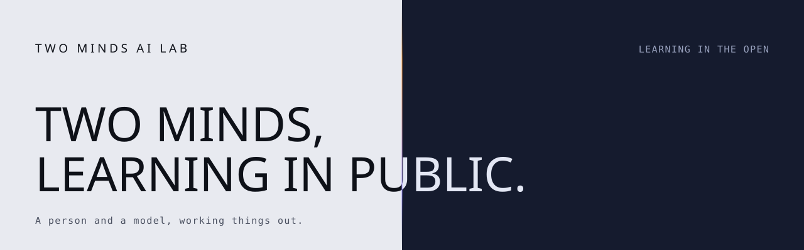

<p align="center">
  
</p>

<p align="center">
  <a href="https://github.com/two-minds-ai-lab/demo-repository/actions/workflows/proof-html.yml"></a>
  <a href="https://github.com/two-minds-ai-lab/demo-repository/actions/workflows/auto-assign.yml"></a>
  
  
</p>

# Two Minds AI Lab

A single model cannot grade its own work. It has no way to separate an answer that is
correct from one that is merely fluent — from the inside, the two feel identical. A second
model, told to break the first, can.

This repository holds the lab's public site and the workflows that build and check it.

**→ [two-minds-ai-lab.github.io/demo-repository](https://two-minds-ai-lab.github.io/demo-repository/)**

## Run it locally

The site has no build step and no runtime dependencies. Any static server works:

```bash
git clone https://github.com/two-minds-ai-lab/demo-repository.git
cd demo-repository
python3 -m http.server 8000
```

Then open <http://localhost:8000>.

## What's in here

| Path | What it is |
| --- | --- |
| `index.html` | The whole site — markup, styles, and behaviour in one file |
| `assets/banner.svg` | The banner at the top of this README |
| `.github/workflows/proof-html.yml` | Checks every link and reference in the rendered HTML |
| `.github/workflows/auto-assign.yml` | Assigns a reviewer when a pull request opens |
| `docs/superpowers/specs/` | The design spec the site was built from |

## How the page is built

**One file, no build step.** GitHub Pages serves this repository's files as they are, so
`index.html` inlines its own styles and script and makes zero external requests. That is a
constraint rather than a preference: anything needing a bundler or a CDN would not survive
the trip to Pages.

**System typefaces only.** A geometric sans for display (Futura, falling back through
Century Gothic to the platform UI face), a serif for body text, and a monospace for labels
and data. No webfonts means no network round-trip and no layout shift.

**The seam is the design.** The hero is typeset twice — once light, once dark — and the
dark copy is clipped at a seam that follows your pointer, so the headline inverts where the
two halves meet. Both copies carry the full text, so nothing is hidden when the script does
not run, and the duplicate is held back from assistive technology to avoid a doubled
reading.

**Degrades honestly.** Scroll reveals are gated behind a `.js` class, so no text is
invisible without JavaScript. `prefers-reduced-motion` pins the seam and drops every
transition. Below 860px the split turns on its side and the layout stacks.

## Contributing

Open an issue or a pull request. `proof-html` runs on every push and must pass — it walks
the rendered HTML and fails on any broken link or reference.

## License

[MIT](LICENSE) © Two Minds AI Lab
